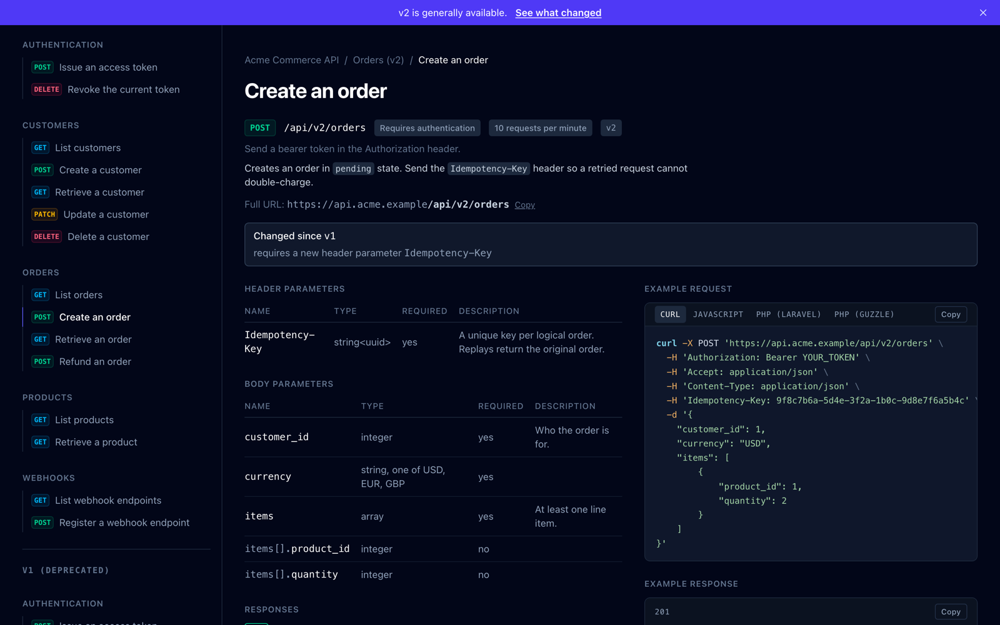
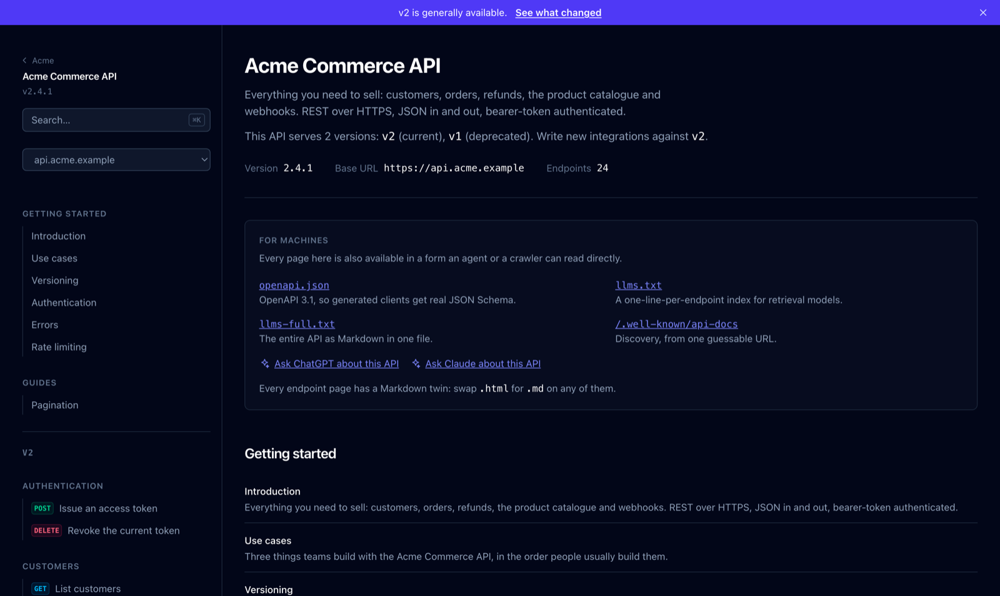

# Lusen

Fast, SEO and AI-agent-friendly API documentation for Laravel.

**[See a live example →](https://lusen.oda.al)** — a fictional commerce API
serving two versions at once, built by the package's own emitters.

Lusen reads your application's routes, form requests and resources, and emits
documentation as **static files** — HTML for people, OpenAPI and Markdown for
machines. There is no build step for consumers, no database, and no JavaScript
required to read a page.

> **Status: early — `0.6.1`.** Prose pages, route collection, FormRequest and
> attribute extraction, request-example generation, API versioning, and the
> static HTML, Markdown, OpenAPI, `llms.txt`, sitemap, search and Postman
> surfaces all work, as does the MCP server.
>
> Endpoint identifiers and the emitted URLs are already treated as a stability
> contract. Configuration keys and the IR are not yet, so pin to the minor you
> installed — `^0.6` today. On a `0.x` version a caret pins the minor, so an
> older `^0.5` will not pick this release up.

## Install

```bash
composer require fpeposhi/lusen
```

That is the whole setup. Lusen discovers `api/*` routes and documents them with
no configuration.

```bash
php artisan lusen:build
```

Writes to `public/docs`, which your web server serves as flat files.

Prefer a live preview while developing? Set `LUSEN_RUNTIME=true` and visit
`/docs` — same Blade views, rendered on request.

## Why another one

Most Laravel API docs packages optimise for one reader: a developer with a
browser. Lusen assumes three, and treats them as equally important.

**People** get server-rendered HTML, one page per endpoint and one per group,
styled with Tailwind — a contents column beside the page, tabbed request
examples, search on `⌘K`, and navigation that works on a phone. All of it
readable with JavaScript disabled: every control is an enhancement over markup
that already works without it.

**Search engines** get canonical URLs, real meta descriptions, JSON-LD
`TechArticle` and `BreadcrumbList` data, and a sitemap. Nothing is behind a
client-side router, so nothing is invisible to a crawler.

**AI agents and generative search** get first-class machine surfaces rather
than scraped HTML:

| Surface | What it is |
| --- | --- |
| `/docs/endpoints/{id}.md` | Every page mirrored in Markdown — swap `.html` for `.md` |
| `/docs/groups/{slug}.html` | One page per group — what a resource is for and every operation on it, for the query that names no operation |
| `/docs/openapi.json` | OpenAPI 3.1 — real JSON Schema, so generated clients stop guessing |
| `/docs/llms.txt` | A curated index, one line per endpoint, per [llmstxt.org](https://llmstxt.org) |
| `/docs/llms-full.txt` | The entire API as Markdown in one file |
| `/.well-known/api-docs` | Discovery document listing every surface, from one guessable URL |
| `/docs/sitemap.xml` | Every page, for crawlers |
| `/docs/search-index.json` | Prebuilt index — search runs in the browser, with no server |
| `php artisan lusen:mcp` | An MCP server, so an agent queries your docs instead of scraping them |
| `/docs/pages/versioning.html` | Which API versions exist, and what changed between the newest two |
| `/docs/postman.json` | A Postman collection, for poking the API before writing code |
| `Accept: text/markdown` | Any docs URL returns Markdown instead of HTML (runtime mode) |
| **Copy for an LLM** | A button on every page that copies its Markdown, not its HTML |
| **Ask ChatGPT / Ask Claude** | A link that hands the page's Markdown to an assistant, question included |

Two rules make those surfaces actually usable:

- **Every page is self-contained.** Each endpoint repeats the base URL, the
  auth requirement, every parameter and a complete example. A model that
  retrieves one page never needs a second one.
- **Identifiers are stable.** An endpoint's `operationId`, anchor and file
  name derive from its route name and do not change between builds, so links
  and citations keep working.

## See it

**[lusen.oda.al](https://lusen.oda.al)** — a fictional commerce API serving two
versions at once, 24 endpoints across 9 groups, `v2` current and `v1`
deprecated with a retirement date. Nothing there is a mockup: it is produced by
running the package's real emitters, so it is exactly what `lusen:build` writes.

[](https://lusen.oda.al/endpoints/v2-orders-store.html)

An endpoint page: the reference on the left, the call on the right. Note what
is derived rather than written — the rate limit and the scopes off middleware,
`Changed since v1` from comparing the two editions of the operation, and
`items[].product_id` from a `items.*.product_id` validation rule.

[](https://lusen.oda.al)

The index. Every page is also a Markdown twin, an OpenAPI operation and a line
in `llms.txt` — swap `.html` for `.md` on any URL and see for yourself.

Build it yourself in one command:

```bash
php tools/build-showcase.php   # 7 prose pages, 9 group pages, 24 endpoint pages, Markdown mirrors, OpenAPI, llms.txt, sitemap, search index
open docs/index.html
```

## Prose, not just endpoints

An endpoint list is useless to someone who does not already know your endpoint
names. Lusen builds a full documentation site: sidebar sections of written pages,
an on-page table of contents, and previous/next links across the whole thing.

Write pages as Markdown in `resources/docs`:

```markdown
---
title: Use cases
section: Guides
order: 10
---

Three things teams build with this API...
```

With no pages written at all, Lusen still generates **Introduction**,
**Authentication** and **Errors** from the spec itself — the auth page reflects
your actual middleware, and the error table lists the statuses your endpoints
really return. Everything generated is derived, never invented: if there is no
authenticated endpoint, there is no authentication page, and if the API serves
one version there is no versioning page. Anything you write wins over the
generated page of the same name.

For the editorial pages nothing can derive — use cases, quickstart — publish
starter stubs to edit:

```bash
php artisan vendor:publish --tag=lusen-pages
```

## MCP: let agents query the docs

Scraping HTML works and is worse — it breaks on every restyle and makes the
model pay for markup it cannot use. Lusen exposes the same documentation as MCP
tools:

```bash
php artisan lusen:mcp
```

Point a client at it. For Claude Code:

```bash
claude mcp add my-api -- php /path/to/your/app/artisan lusen:mcp
```

Or in a client's config file:

```json
{
  "mcpServers": {
    "my-api": {
      "command": "php",
      "args": ["/path/to/your/app/artisan", "lusen:mcp"]
    }
  }
}
```

Five tools:

| Tool | What it does |
| --- | --- |
| `search_documentation` | Keyword search across endpoints and guides |
| `list_endpoints` | The whole surface, grouped |
| `get_endpoint` | One endpoint in full — parameters, responses, example |
| `read_guide` | Introduction, versioning, authentication, errors, rate limiting, use cases |
| `build_request` | A runnable request with your values filled in |

Every tool returns the same Markdown a person reads, so there is one set of
documentation to keep correct rather than two.

## Documenting an endpoint

Most of it is inferred. Path parameters and auth come from the route; **request
bodies and query strings come from your FormRequest**, so an application that
already validates its input documents itself:

```php
public function rules(): array
{
    return [
        'email'              => 'required|email|max:255',
        'status'             => ['required', Rule::enum(OrderStatus::class)],
        'items'              => 'required|array|min:1',
        'items.*.product_id' => 'required|integer',
    ];
}
```

becomes a required `email` with `format: email` and `maxLength: 255`, a `status`
enum listing the enum's cases, and `items` as an array of objects — plus a
runnable cURL example whose values satisfy those rules. Lusen reads `rules()` by
parsing it, never by instantiating the request, so a docs build works in CI with
no `.env` and no database.

**Responses come from your API resources.** A `JsonResource`'s `toArray()` is a
precise statement of the response shape, so Lusen reads it — following nested
resources and collections, applying Laravel's `data` wrapper, and adding
pagination metadata when the collection is paginated.

**Field types come from your models.** A resource says `$this->price` and nothing
more, so Lusen looks at the model behind it: casts first, then the column
definitions in your migrations, which are also the only place nullability is
stated. So this:

```php
return ['price' => $this->price, 'sku' => $this->sku, 'status' => $this->status];
```

documents `price` as a number, `sku` as a nullable string with your column's
length limit, and `status` as an enum listing its real cases — with no
annotations anywhere. Anything nothing can answer stays untyped rather than
guessed; an unknown type documented as `string` is a guess a reader would act on.

**Prose comes from your docblocks.** If your controllers are commented, that is
your API reference — summary, description, `@group`, `@deprecated`,
`@authenticated`. Laravel's scaffolded comments ("Display a listing of the
resource") are ignored rather than repeated on every endpoint, and undocumented
resource actions get conventional wording instead: `index` on a Customers
controller reads "List customers", not "Index".

Attributes are how you say something inference cannot see, and they always win
over what was inferred.

```php
use Lusen\Attributes\{ApiDoc, ApiGroup, ApiParam, ApiResponse, Hidden};

#[ApiGroup('Users', 'Create and read user accounts.')]
final class UserController extends Controller
{
    #[ApiDoc(summary: 'List users', description: 'A paginated list of every user.')]
    #[ApiParam('per_page', in: 'query', type: 'integer', example: 25)]
    #[ApiResponse(200, 'A page of users.', example: ['data' => [['id' => 1, 'name' => 'Ada']]])]
    public function index(): AnonymousResourceCollection
    {
        return UserResource::collection(User::paginate());
    }

    #[Hidden]
    public function internalMetrics(): JsonResponse { /* ... */ }
}
```

## Responses, with or without API resources

Lusen documents response bodies from the API resource an action returns. When
there is no resource — an API answering with plain arrays through a
base-controller helper — it reads the shape you wrote instead:

```php
/**
 * @response array{status: true, data: array{orders: list<OrderShape>, total: int}}
 */
```

That is the PHPStan grammar, and any class it names is read too: public typed
properties become fields, their docblocks become descriptions. See
[AUTHORING.md](AUTHORING.md#responses-without-an-api-resource).

## Two versions at once

An API that has lived long enough serves `/api/v1/orders` next to
`/api/v2/orders`, and documenting that badly is the worst thing a reference can
do: two pages titled "List orders", two identical meta descriptions competing
for the same query, and an assistant with no way to tell which one to recommend.

Lusen reads the version out of the path. Nothing to configure:

- The reference is grouped by version, newest first, and every page badges the
  version it belongs to.
- Each older endpoint links to its replacement — matched by method and path, so
  `GET /api/v1/orders` finds `GET /api/v2/orders` on its own.
- Titles, meta descriptions, OpenAPI tags, Postman folders and search results
  all name the version, so nothing competes with itself.
- A **Versioning** page is derived: which versions exist, which to use, and
  what the newest one added or dropped compared with the one before it.

The two things a URL cannot tell you are configurable:

```php
'versions' => [
    'current' => 'v2',                      // default: the newest found
    'deprecated' => ['v1' => '2026-06-01'], // a date, or just ['v1']
],
```

Deprecating a version marks every endpoint in it deprecated and points each one
at its successor. An API that negotiates its version in a header leaves nothing
in the path to read, so its controllers say so with
`#[ApiDoc(version: 'v2')]`.

## Built to be read

Documentation people avoid is documentation nobody maintains, so the reading
experience is a feature rather than a skin:

- **Two columns on an endpoint page.** What the endpoint is on the left, what
  a call to it looks like on the right, sticky beside the reference — the
  parameter you are reading about and the example that uses it on screen
  together. One column, in reading order, on a narrow screen.
- **Navigation at every width.** Rendered once and moved by CSS — a column
  beside the content on a laptop, a panel behind one tap on a phone, and the
  end of the document with no JavaScript at all.
- **A contents column** on every page. Each of an endpoint's sections carries
  a stable anchor, so `#users-index-responses` is a link worth citing.
- **Tabbed request examples**, remembered across pages, and response bodies
  tabbed by status. Both ship stacked, so a reader without JavaScript — and a
  model reading the HTML — still gets every one.
- **Search on `⌘K`** over a prebuilt index, with the arrow keys. No search
  service, no API key.
- **A base URL switcher** when `servers` lists more than one, rewriting the
  host in every example so what gets copied is what was chosen.
- **Copy for an LLM**, handing over the page's Markdown rather than its
  markup — or **Ask ChatGPT / Ask Claude**, which sends them the same file with
  the question already written. Which assistants, and what they are asked, is
  yours to set.
- **`ui.edit_url`** puts an *Edit this page* link on everything you wrote —
  the cheapest thing there is for keeping prose honest.

## Try it, without a proxy

Turn it on and every documented `GET` grows a **Try it** dialog that sends the
request and shows what came back:

```php
'try_it' => [
    'enabled' => env('LUSEN_TRY_IT', false),   // off until you say so
    'methods' => ['GET'],                      // a Send button beside a write is a footgun
],
```

The request goes **straight from the browser to your API**. There is no
Lusen server in the middle, because static docs have nowhere to put one. So it
works out of the box when the docs and the API share an origin — runtime mode,
or docs on the API's own domain — and otherwise your API has to allow the docs
origin:

```http
Access-Control-Allow-Origin: https://docs.example.com
Access-Control-Allow-Headers: authorization, content-type
```

When that header is missing, the page says exactly that, names both origins and
prints the two lines above with your values in them. A browser reports a
blocked response and an API that is genuinely down in identical terms, and
`TypeError: Failed to fetch` sends people to look at the wrong thing.

The dialog repeats everything the page behind it says — the host, the scheme,
the rate limit, each field's type and description — and shows the call as it
stands, updated as you edit it, so nobody has to press send to find out what
send would do.

Readers set their credential once, in a **Set up to test** section on the
Authentication page, and every dialog uses it. It stays in their browser for
the tab (`persist_token` can extend that to the browser, behind a checkbox they
tick), goes out only as the header it authenticates, is masked in the preview,
and never ends up in the snippet the copy button hands over.
`#[ApiDoc(tryIt: false)]` withdraws a single endpoint — an export that takes a
minute, a search that costs money per call.

## Writing the parts Lusen cannot infer

Prose pages, examples worth writing by hand, attributes, docblock tags and
every configuration knob are covered in **[AUTHORING.md](AUTHORING.md)**.

The short version: what you write always wins, and Lusen would rather document a
field as `any` than guess at it.

## Configuration

Every key has a working default; publish the file only if you need to change
something.

```bash
php artisan vendor:publish --tag=lusen-config
```

## Commands

```bash
php artisan lusen:build                      # emit every enabled surface
php artisan lusen:build --only=openapi       # just one
php artisan lusen:build --dry-run            # report without writing
php artisan lusen:build --path=/tmp/docs     # override the output directory
php artisan lusen:build --fresh              # ignore the incremental cache
php artisan lusen:check                      # report endpoints missing documentation
php artisan lusen:check --strict             # ...and fail CI when any are
php artisan lusen:check --json               # the same findings, for a script
php artisan lusen:diff --save                # record this build as the baseline
php artisan lusen:diff                       # what changed since, and what of it breaks
php artisan lusen:diff --strict              # ...and fail CI on the breaking ones
php artisan lusen:diff --json                # the same changes, for a script
php artisan lusen:record                     # capture real responses from your test suite
php artisan lusen:record --fresh             # re-record everything
php artisan lusen:record --clear             # delete them; examples fall back to the schema
```

Builds are incremental. An endpoint is re-analysed only when its route or one
of the files behind it actually changed — comparing contents, not timestamps,
so a fresh checkout or a CI runner still gets the benefit. Add `.lusen` to your
`.gitignore`.

## Request examples

Every endpoint page carries the same request in several languages, tabbed
where the script runs and stacked where it does not:

| | |
| --- | --- |
| On by default | `curl`, `javascript`, `laravel`, `guzzle` |
| Available | `python` (requests), `go` (net/http) |

Set `ui.snippets` to the ones your readers actually write. Python and Go are
off by default because six tabs is a strip nobody reads, and which two your
readers want is a question only you can answer.

All of them render the same assembled request, so no tab can drift from
another or from the request the playground sends.

## Real examples, not plausible ones

A generated example satisfies the schema and nothing else. It says
`"status": "string"` where your API says `"paid"`, and a reader who copies one
into a client has learned the shape without ever seeing the thing.

Your test suite is already producing real responses. Borrow them:

```bash
php artisan lusen:record   # runs your suite with capture on
```

Every response it saw is written to `.lusen-recordings.json` — commit it — and
the build uses those bodies instead of inventing them.

Recording borrows the tests because they have already booted the application,
which a docs build never does. The build only ever reads the file, so
`lusen:build` still runs against a checkout with no `.env` and no database.

Three things worth knowing. **The first recording of an operation wins**, so a
suite with random fixtures does not rewrite the file with fresh names on every
CI run; `--fresh` is how you ask for all of them again. **Fields you name in
`record.redact` are replaced wherever they appear** — the field, its name and
its position are kept, because the shape is what documents the API and the
value is the part nobody should be reading in a pull request. And **an
`#[ApiResponse(example: …)]` still wins**, because somebody wrote that down on
purpose.

## Does this branch break somebody's client?

The docs already know every parameter, every response field and every
validation rule, which makes them the one thing in the repository that can
answer that before a customer does.

```bash
php artisan lusen:diff --save    # on main, once. Commit .lusen-baseline.json
php artisan lusen:diff --strict  # on every pull request
```

Changes come back in three grades, and only one of them fails a build:

| | |
| --- | --- |
| **Breaking** | A removed endpoint or response field, a new required parameter, a type change, a tightened `max`, a newly required scope, an operation id that moved |
| **Added** | New endpoints, optional parameters, extra enum members, relaxed rules |
| **Notice** | Deprecations, reworded summaries, and a field the extractors have only now managed to type |

That last row is the reason this is usable. Adding a cast to a model turns
`any` into `integer` on every endpoint that returns the field, and a gate that
went red for it would be switched off in a week — so a type arriving or
departing is never counted as breaking. An endpoint that *stops* requiring
authentication is the mirror image: it breaks nobody, so it cannot fail the
build, but it is reported in the words it deserves.

## Contributing

```bash
composer install
composer test        # Pest + Orchestra Testbench
composer check       # Pint, PHPStan at level max, then the suite
```

The docs UI is Tailwind v4. `dist/lusen.css` is committed so installing Lusen
never requires Node — if you change classes in `resources/views`, run
`npm install && npm run build` and commit the CSS in the same change.

## The name

Lusen is a high plateau above Kukës, in northern Albania, that ends in a sheer
drop. The mark is its profile: high ground, an undercut face, the valley far
below — which turns out to be the letter the name starts with.

`art/lusen-mark.svg` inherits `currentColor`, so beside text it is whatever
colour that text is. `art/lusen-icon.svg` is the badge form, carrying its own
colours — which is the one to use anywhere the surrounding theme is unknown, a
README on a site with a dark mode included.

## Licence

MIT.
